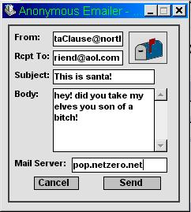



## Anonymous Emailer

### Description

Easily send email to a friend if your email application is broken or you want to fool around with someones head and send them messed up emails from santa clause.
 
### More Info
 
umm, dont mess around with my code pleaze!

Returns joy!

Hmm, dont use the program on a server your not supposed to!

             |
---                |---
**Submitted On**   |2000-10-30 14:27:40
**By**             |[Alex](https://github.com/Planet-Source-Code/PSCIndex/blob/master/ByAuthor/alex.md)
**Level**          |Advanced
**User Rating**    |3.4 (31 globes from 9 users)
**Compatibility**  |VB 5\.0, VB 6\.0
**Category**       |[Complete Applications](https://github.com/Planet-Source-Code/PSCIndex/blob/master/ByCategory/complete-applications__1-27.md)
**World**          |[Visual Basic](https://github.com/Planet-Source-Code/PSCIndex/blob/master/ByWorld/visual-basic.md)
**Archive File**   |[CODE\_UPLOAD1113410302000\.zip](https://github.com/Planet-Source-Code/alex-anonymous-emailer__1-12414/archive/master.zip)

